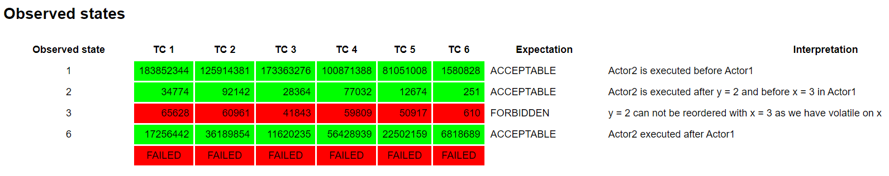

[](https://travis-ci.com/mtumilowicz/java8-concurrency-jcstress-happens-before)
[](https://opensource.org/licenses/MIT)

# java12-concurrency-jcstress-happens-before

## reference
* [A practical approach to Java Memory Model with Andrzej Czarny](https://www.youtube.com/watch?v=pS5dPQwgnYo)
* https://github.com/amczarny/JMMPresentation
* https://www.amazon.com/Java-Concurrency-Practice-Brian-Goetz/dp/0321349601

## jcstress
* The Java Concurrency Stress tests (jcstress) is an experimental harness and a suite of tests to aid the research 
in the correctness of concurrency support in the JVM, class libraries, and hardware
* most of the tests are probabilistic, and require substantial time to catch all the cases
    * it is highly recommended to run tests longer to get reliable results
* most of the tests require at least 2 online CPUs
    * low CPU count machines could also use these tests, but harness will force yielding there
* samples: http://hg.openjdk.java.net/code-tools/jcstress/file/tip/jcstress-samples/src/main/java/org/openjdk/jcstress/samples
    * **APISample_** describe the API, 
    * **JMMSample_** describe the basics of Java Memory Model, 
    * **ConcurrencySample_** show the interesting concurrent behaviors of standard library
* API: http://hg.openjdk.java.net/code-tools/jcstress/file/tip/jcstress-core/src/main/java/org/openjdk/jcstress/annotations/

### overview
* `@JCStressTest` - marks the class that should be as the concurrency stress test
* `@Outcome`
    * `@Outcome(id = "1", expect = Expect.ACCEPTABLE, desc = "Actor2 is executed before Actor1")`
    * describes the test outcome, and how to deal with it
    * usually has multiple outcomes, each with its distinct `id`
    * `id` is cross-matched with `@Result`-class' `toString()` value
        * allows regular expressions
    * there can be a default outcome, which captures any non-captured result (default `id`)
    * fields
        * `String[] id() default { "" }`
            * observed result
            * supports regular expressions
        * `Expect expect()`
            * expectation for the observed result
            * values
                `ACCEPTABLE` - are not required to be present
                `ACCEPTABLE_INTERESTING` - same as `ACCEPTABLE`, but this result will be highlighted in reports
                `FORBIDDEN` - should never be present
        * `String desc() default ""` - human-readable description for a given result
* `@State`
     * annotates the class that holds the data mutated/read by the tests
     * class should be public, non-inner class
     * class should have a default constructor
     * tests should try to minimize state instance footprint (during the run, many `@State` instances are created)
* `@Actor`
     * marks the methods that hold the actions done by the threads
     * each method is called only by one particular thread
     * each method is called exactly once per `@State` instance
     * invocation order against other `@Actor` methods is deliberately not specified
     * `@Actor`-annotated methods can have only the `@State` or `@Result`-annotated classes as the parameters
* `@Result`
    * marks the result object
    * jcstress ships lots of pre-canned result classes - see `org.openjdk.jcstress.infra.results` package
    * one of many implementations: `I_Result` (one `int` holder)
### results


## happens-before
* in computer science, the happened-before relation is a relation between the result of two events, 
such that if one event should happen before another event, the result must reflect that, even if those 
events are in reality executed out of order (usually to optimize program flow)
* compilers may generate instructions in a different order than in the source code
* variables could be stored in registers instead of memory
* processors may execute instructions in parallel or out of order
* caches may vary the order in which writes to variables are committed to main memory
* values stored in processor-local caches may not be visible to other processors
* Since most of the time threads are doing their own things, excessive inter-thread
  coordination will have no real benefit (only slows down the application)
* to guarantee that the thread executing action B can see the results of action A, there must
  be a happens-before relationship between A and B (partial ordering)
    * whether or not A and B occur in different threads
* in the absence of a happens-before ordering between two operations, the JVM is free to reorder them
* data race
    * a variable is read by more than one thread
    * and written by at least one thread
    * but the reads and writes are not ordered by happens-before
* rules for happens-before:
    * **program order rule**: each action in a thread happens-before every action
    in that thread that comes later in the program order
    * **monitor lock rule**: an unlock on a monitor lock happens-before every
    subsequent lock on that same monitor lock
    * **volatile variable rule**: a write to a volatile field happens-before every
    subsequent read of that same field
    * **thread start rule**: call to `Thread.start` on a thread happens-before
    every action in the started thread
    * **thread termination rule**: any action in a thread happens-before any
    other thread detects that thread has terminated (either by successfully
    return from `Thread.join` or by `Thread.isAlive` returning
    `false`)
    * **interruption rule**: thread calling interrupt on another thread
    happens-before the interrupted thread detects the interrupt (either
    by having `InterruptedException` thrown, or invoking `isInterrupted`
    or `interrupted`)
    * **finalizer rule**: the end of a constructor for an object happens-before
    the start of the finalizer for that object
    * **transitivity**: A happens-before B AND B happens-before C => A happens-before C
    * when two threads synchronize on different locks, we can’t say anything about the ordering
      of actions between them — there is no happens-before relation
  
## volatile
* Java Memory Model ensures that all threads see a consistent value of the variable
* every read of a `volatile` variable will be read from the computer's main memory, and not from the CPU cache
* every write to a `volatile` variable will be written to main memory, and not just to the CPU cache
* prevents compiler / CPU code reordering
* when we write to a `volatile` variable, it creates a **happens-before** relationship with each subsequent 
read of that same variable 
    * so any memory writes that have been done until that `volatile` variable write, will subsequently 
    be visible to any statements that follow the read of that `volatile` variable
* characterizing the situations under which `volatile` can be used safely involves determining whether 
each update operation can be performed as a single atomic update

### remarks
* updates to non-volatile long or a double may not be atomic
* Java operators like `++` and `+=` are not atomic
* why an `Object` member variable can't be both `final` and `volatile` in Java?
    * JMM promises that after `ctor` is finished any thread will see the same (correct) value of final field

## project
```
$ mvn clean install
$ java -jar target/jcstress.jar -v -t HappensBeforeExample
```
* we could use intellij's maven command line and running `java -jar target/jcstress.jar -v -t HappensBeforeExample`
* reports in readable form: `results/jcstress.HappensBeforeExample`

### overview
```
@JCStressTest
@Outcome(id = "1", expect = Expect.ACCEPTABLE, desc = "Actor2 is executed before Actor1")
@Outcome(id = "2", expect = Expect.ACCEPTABLE, desc = "Actor2 is executed after y = 2 and before x = 3 in Actor1")
@Outcome(id = "3", expect = Expect.FORBIDDEN, desc = "y = 2 can not be reordered with x = 3 as we have volatile on x")
@Outcome(id = "6", expect = Expect.ACCEPTABLE, desc = "Actor2 executed after Actor1")
@State
public class HappensBeforeExample {
   int y = 1;
   volatile int x = 1;

   @Actor
   void actor1() {
      y = 2;
      x = 3;
   }

   @Actor
   void actor2(I_Result r) {
      r.r1 = y * x; // wrong in this line!
   }
}
```
* there are some outcomes with 3, why?
    * in java, expressions are evaluated from left to right, so the last line: `r.r1 = y * x` should be reversed:
    `r.r1 = x * y` to guarantee happens-before
